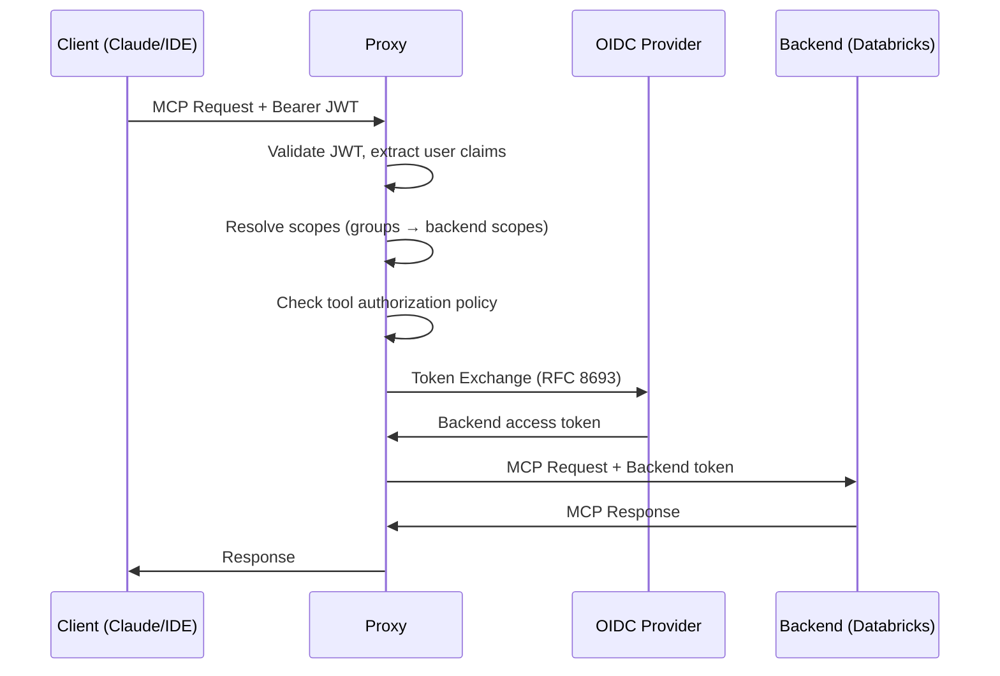

# SUSE AI Universal Proxy - Security

## Overview

The SUSE AI Universal Proxy implements comprehensive security for MCP (Model Context Protocol) access, including:

- **Upstream OAuth 2.1** - Client authentication to the proxy
- **Downstream Authentication** - Proxy-to-backend authentication (token exchange, SPIFFE, service accounts)
- **Tool-Level Authorization** - Fine-grained access control for MCP tools
- **Scope Policies** - User-specific permissions based on OIDC groups
- **Audit Logging** - Security event tracking

## Security Architecture

### Defense in Depth

```
┌─────────────────────────────────────────────────────────────────────┐
│                         Client (Claude, IDE)                         │
└─────────────────────────────────────────────────────────────────────┘
                                   │
                           OAuth 2.1 JWT
                                   ▼
┌─────────────────────────────────────────────────────────────────────┐
│                     SUSE AI Universal Proxy                          │
│  ┌─────────────────┐  ┌──────────────────┐  ┌───────────────────┐  │
│  │ OAuth Middleware│─▶│ Tool Authorization│─▶│ Downstream Auth   │  │
│  │ (validate JWT)  │  │ (policy engine)   │  │ (token exchange)  │  │
│  └─────────────────┘  └──────────────────┘  └───────────────────┘  │
│            │                    │                     │             │
│            ▼                    ▼                     ▼             │
│     User Context         Scope Resolution       Token Vault         │
│     (groups, roles)      (user → scopes)        (cache, refresh)    │
└─────────────────────────────────────────────────────────────────────┘
                                   │
                    Downstream Auth (RFC 8693, SPIFFE, etc.)
                                   ▼
┌─────────────────────────────────────────────────────────────────────┐
│                    Backend MCP Servers                               │
│        (ServiceNow, Databricks, Uyuni, Bugzilla, etc.)              │
└─────────────────────────────────────────────────────────────────────┘
```

### Upstream Authentication (Client → Proxy)

#### OAuth 2.1 Implementation
- **PKCE Protection**: Mandatory Proof Key for Code Exchange
- **JWT Validation**: Tokens validated for signature, expiration, and audience
- **Claims Extraction**: User ID, email, groups, roles extracted from OIDC claims
- **Session Management**: Access tokens linked to user sessions

### Downstream Authentication (Proxy → Backend)

#### Token Exchange (RFC 8693)
- **User Identity Flow**: User's OIDC ID token (e.g., from Rancher) exchanged for backend-specific token
- **Scope Policies**: User groups determine which scopes are requested
- **Token Caching**: Exchanged tokens cached with automatic refresh
- **Audience Validation**: Tokens scoped to specific backend services

#### SPIFFE Workload Identity
- **JWT SVID**: SPIRE-issued JWT used for token exchange
- **X.509 mTLS**: Certificate-based authentication for zero-trust networks
- **Automatic Rotation**: SVIDs refreshed automatically by SPIRE agent

#### Service Account with Impersonation
- **Proxy Credentials**: Proxy authenticates as service account
- **User Impersonation**: User identity passed via configurable header
- **Scope Headers**: User's resolved scopes sent to backend

### Token Security
- **Audience Validation**: Tokens validated for correct backend audience
- **No Token Passthrough**: Client tokens never forwarded to backends
- **Encrypted Storage**: Token vault encrypts tokens at rest
- **Automatic Refresh**: Tokens refreshed before expiration

### Request Flow Example



This flow shows:
1. **Client authentication**: JWT validated, user identity extracted
2. **Scope resolution**: User's groups mapped to backend-specific scopes
3. **Tool authorization**: Policy engine checks if user can access the tool
4. **Token exchange**: User's OIDC token exchanged for backend token
5. **Backend request**: Request forwarded with backend-specific credentials

### Configuration Security

#### Secure Configuration Options
```yaml
authorization:
  enabled: true
  clientRegistration:
    dynamic: true  # Use dynamic registration when possible
    staticClients: # Fallback for servers without dynamic reg
      - server: "https://mcp.example.com"
        clientId: "${CLIENT_ID}"  # Use environment variables
        clientSecret: "${CLIENT_SECRET}"
  tokenStorage:
    encryptionKey: "${ENCRYPTION_KEY}"  # Required for production
    rotationInterval: "24h"
  flows:
    redirectUri: "https://proxy.example.com/oauth/callback"
    timeout: "5m"
    pkceRequired: true  # Always enabled
```

#### Environment Variables
```bash
# Required for production
export ENCRYPTION_KEY="32-char-encryption-key-here"
export CLIENT_ID="proxy-client-id"
export CLIENT_SECRET="proxy-client-secret"

# Optional OAuth server credentials
export OAUTH_CLIENT_ID="global-client-id"
export OAUTH_CLIENT_SECRET="global-client-secret"
```

## Tool-Level Authorization

The proxy implements fine-grained tool access control via authorization policies.

### Policy Evaluation

```
User Request → Scope Resolution → Policy Engine → Allow/Deny
                    │                   │
                    ▼                   ▼
              groups → scopes     policies check:
              (via scope_policies)   - allowed_groups
                                     - denied_groups
                                     - required_scopes
```

### Policy Types

| Effect | Description |
|--------|-------------|
| `allow` | Grant access if user matches criteria |
| `deny` | Block access if user matches criteria (takes precedence) |

### Policy Fields

| Field | Description |
|-------|-------------|
| `allowed_groups` | User must be in one of these groups |
| `denied_groups` | User must NOT be in any of these groups |
| `allowed_users` | User ID/email must match |
| `denied_users` | User ID/email must NOT match |
| `required_scopes` | User must have ALL of these resolved scopes |
| `priority` | Higher priority policies evaluated first |

### Example: Restrict Dangerous Tools

```json
{
  "policy_id": "deny-drop-table-default",
  "adapter_name": "databricks",
  "tool_name": "drop_table",
  "effect": "deny",
  "priority": 0
}
```

```json
{
  "policy_id": "allow-drop-table-admins",
  "adapter_name": "databricks",
  "tool_name": "drop_table",
  "effect": "allow",
  "allowed_groups": ["data-engineers"],
  "required_scopes": ["sql:write"],
  "priority": 10
}
```

Result: Only users in `data-engineers` with `sql:write` scope can use `drop_table`.

## Audit Logging

Security events are logged for compliance and incident response:

| Event Type | Description |
|------------|-------------|
| `auth_success` | User authentication succeeded |
| `auth_failure` | User authentication failed |
| `token_exchange` | RFC 8693 token exchange performed |
| `tool_access_denied` | Tool call blocked by policy |
| `adapter_access` | Adapter accessed by user |

### Audit Log Format

```json
{
  "timestamp": "2024-01-01T12:00:00Z",
  "event_type": "tool_access_denied",
  "user_id": "alice@example.com",
  "adapter_name": "databricks",
  "tool_name": "drop_table",
  "detail": "denied_by_policy=deny-drop-table-default",
  "success": false
}
```

## Threat Mitigation

### 1. Token Theft Protection
- **Short-lived Tokens**: Automatic token refresh before expiration
- **Encrypted Storage**: Token vault encrypts tokens at rest
- **Per-User Tokens**: Tokens scoped to individual users
- **Token Rotation**: Refresh tokens rotated on each use

### 2. Privilege Escalation Prevention
- **Scope Policies**: Users only get scopes appropriate to their groups
- **Tool Authorization**: Fine-grained control over which tools users can access
- **Deny Takes Precedence**: Explicit deny policies override allow policies
- **Audit Trail**: All access attempts logged for review

### 3. Confused Deputy Prevention
- **Audience Validation**: Tokens validated for correct backend service
- **User Context**: User identity preserved through the request chain
- **No Token Passthrough**: Client tokens never forwarded to backends

### 4. Communication Security
- **HTTPS Only**: All endpoints require HTTPS in production
- **TLS Validation**: Strict certificate validation
- **SPIFFE mTLS**: Zero-trust workload identity available

### Operational Security

#### Monitoring & Alerting
```bash
# Check authorization status
curl http://localhost:8001/adapters/{name}/auth/status

# Monitor token expiration
curl http://localhost:8001/adapters/{name}/sessions | jq '.sessions[].tokenExpiresAt'

# View authorization events
tail -f /var/log/proxy/authorization.log
```

#### Incident Response
1. **Token Compromise**: Immediately revoke via `DELETE /adapters/{name}/auth/tokens`
2. **Authorization Failures**: Check logs for OAuth error details
3. **Suspicious Activity**: Monitor for unusual authorization patterns

#### Audit Logging
All authorization events are logged:
```
2024-01-01T12:00:00Z INFO Authorization started for adapter=mcp-server user=alice
2024-01-01T12:00:05Z INFO Token obtained for adapter=mcp-server expires=2024-01-01T13:00:00Z
2024-01-01T12:30:00Z INFO Token refreshed for adapter=mcp-server
```

### Best Practices

#### Production Deployment
1. **Enable HTTPS**: Configure TLS termination
2. **Set Encryption Key**: Required for token storage
3. **Configure Redirect URIs**: Register proxy callback URLs with auth servers
4. **Monitor Token Usage**: Set up alerts for unusual patterns
5. **Regular Key Rotation**: Rotate encryption keys periodically

#### Development Setup
1. **Use Local Auth Server**: For testing, use local OAuth server
2. **Disable Auto-Auth**: Test manual authorization flows
3. **Enable Debug Logging**: Log authorization flow details
4. **Validate Tokens**: Test token validation logic

### Compliance

#### OAuth Standards
- ✅ RFC 6749 - OAuth 2.0 Authorization Framework
- ✅ RFC 6750 - OAuth 2.0 Bearer Token Usage
- ✅ RFC 7636 - PKCE for OAuth 2.0
- ✅ RFC 8693 - OAuth 2.0 Token Exchange
- ✅ RFC 8414 - OAuth 2.0 Authorization Server Metadata

#### Identity Standards
- ✅ OpenID Connect Core 1.0
- ✅ SPIFFE (Secure Production Identity Framework for Everyone)
- ✅ JWT (RFC 7519) validation

#### Security Standards
- ✅ TLS 1.2+ for all communications
- ✅ Encrypted token storage
- ✅ Audit logging
- ✅ Principle of least privilege (scope policies)

### Troubleshooting

#### Common Issues

**401 Unauthorized from MCP Server**
```bash
# Check if authorization is configured
curl http://localhost:8001/adapters/{name}/auth/status

# Trigger manual authorization
curl -X POST http://localhost:8001/adapters/{name}/auth/authorize
```

**Token Expired**
```bash
# Force token refresh
curl -X POST http://localhost:8001/adapters/{name}/auth/refresh
```

**OAuth Discovery Failed**
```bash
# Check MCP server metadata endpoint
curl https://mcp.example.com/.well-known/oauth-protected-resource

# Verify authorization server
curl https://auth.example.com/.well-known/oauth-authorization-server
```

### Implementation Status

#### Completed Features
- ✅ OAuth 2.1 client authentication with PKCE
- ✅ JWT validation and claims extraction
- ✅ RFC 8693 token exchange with token vault
- ✅ Scope policies for user-specific permissions
- ✅ Tool-level authorization policies
- ✅ Policy management API (CRUD for authorization policies)
- ✅ SPIFFE workload identity (JWT SVID and X.509 mTLS)
- ✅ Service account authentication with impersonation
- ✅ Automatic token refresh and caching
- ✅ Token revocation endpoint (RFC 7009)
- ✅ Unified MCP endpoint with aggregated authorization
- ✅ Audit logging for security events
- ✅ Merged groups architecture (OIDC + local)

#### Future Enhancements
- 🔄 Browser-based authorization UI for OAuth flows
- 🔄 Per-user/adapter rate limiting